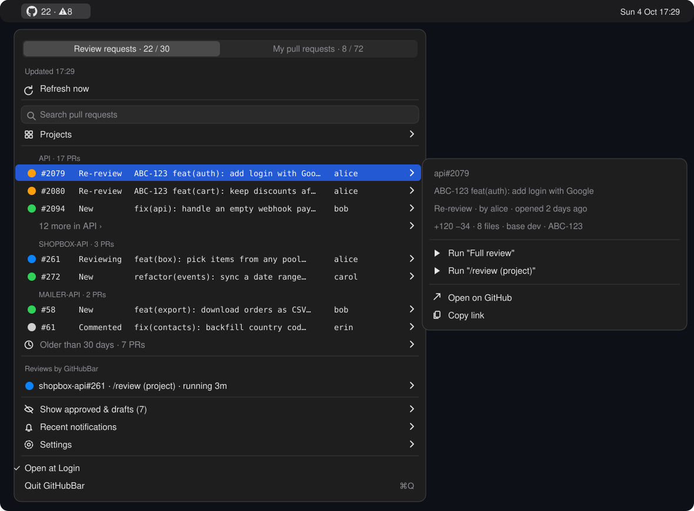

# GitHub Status Bar for macOS — GitHubBar + chip, your PR review inbox for Claude Code

**GitHubBar** is a macOS menu bar app that shows the GitHub pull requests waiting for **your** review and your **own** open pull requests. With one click, it runs your Claude Code review skill on a PR in the background. **chip** is the command-line tool behind it. chip also powers a `/chip` skill, an `@`-mention picker inside Claude Code and an fzf picker in the terminal.

<p align="center">
  
</p>

## Features

### What the numbers mean

| Where | Shows |
|---|---|
| Icon `19 · ⚠8` | PRs to review that wait on you · your own PRs that wait on you (hover for a tooltip) |
| Icon ring / dot | A ring spins around the icon while a review runs; a yellow dot means a review needs your input |
| Icon `🔵1 🟡1` | The same as badges, if you turn them on |
| Tab `Review requests · 19 / 27` | to do / all PRs that request your review |
| Tab `My pull requests · 8 / 72` | to do / all your open PRs |

**To review** = 🟠 re-review (new commits after your review, or re-requested) + 🟢 new requests younger than 30 days. Not counted: older requests, PRs where you commented and wait on the author, approved PRs and drafts.

**Your PRs to do** = 🔴 changes requested + ❌ CI failed + ⚠️ conflict + 💬 unresolved threads + ✅ approved and ready to merge. Not counted: PRs waiting for reviewers, drafts.

### A menu that stays open
- **Tabs:** *Review requests* (default) and *My pull requests* sit in a tab bar at the top. Switching is instant and keeps the menu open; both tabs share one width, and the choice is remembered.
- **Refresh now** keeps the menu open: it shows a spinner and *Refreshing…* while it fetches from GitHub, updates the list in place, then says *✓ Up to date* for two seconds.
- **Projects ›** and **Settings › Status style** toggle their checkmarks without closing the menu, so you can hide several projects in a row.
- **Settings › Menu bar** chooses what the menu bar shows: **Show counts** (`19 · ⚠8`, on), **Show review badges** (`🔵1 🟡1`, off) and **Animate while reviewing** (the spinning ring and yellow dot, on). Turn everything off for a plain icon; the tooltip always has the full counts.
- **Run, Continue review, Stop, Remove, Re-request review, Copy link** keep the menu open: the row shows a spinner, then the outcome (e.g. "✓ Review started"), and the PR row and the review list update in place.
- **Updates within about a minute.** Every minute GitHubBar asks GitHub Notifications whether anything changed (`If-Modified-Since`; "nothing new" is a free `304`). A new review request, a review or comment on your PR, a mention, a merge or a CI result fetches everything at once, so the numbers and notifications follow within ~1 minute. Without such a change, the full list is still refreshed every 5 minutes (changes GitHub does not notify, such as a conflict on someone else's PR). If notifications are not available to your `gh` token, chip falls back to a full refresh every 3 minutes.

### Review requests tab (default)
- **Every PR waiting for you**, from two searches: `review-requested:@me` and `reviewed-by:@me`. GitHub drops you from the requested reviewers once you review, so the second search is what keeps PRs that need a **re-review** visible.
- **Grouped by project, newest change first.** PRs waiting on you (re-reviews and new requests) come first, ordered by their latest change (opened or new commits), so a request that just arrived is at the top. Every project is always visible, with up to 5 PRs each and the rest under `N more in <project> ›`, paged 12 at a time with nested `Next ›` submenus.
- **Status on every row:** 🟠 Re-review (new commits after your review, or you were re-requested) · 🟢 New · ⚪ Waiting on author / Commented. PRs older than 30 days go under **Older than 30 days**, and approved PRs and drafts under **Show approved & drafts**.
- **PR submenu:**
  - the full title, status, author, age, size, base branch (flagged *stacked*), Jira key and conflict;
  - review buttons: one `Run "<skill>"` per skill in your config, plus `Run "/review (project)"` when the repo has its own review skill (see [Which review runs](#which-review-runs));
  - **Approve…**, **Request changes…** (a reason is required) and **Comment…**, each confirmed in a small dialog;
  - Open on GitHub and Copy link.

### My pull requests tab
- **Your open PRs, grouped by project.** Each row shows its status, first match wins: 🔴 Changes requested · ❌ CI failed · ⚠️ Conflict · 💬 N unresolved threads · ✅ Approved · ⚪ Waiting · ⚪ Draft.
- **Reviewer column:** `bob ✗ carol ✓` (✓ approved, ✗ changes requested, 💬 commented), or `→ bob, carol` while you are still waiting on requested reviewers.
- **Address review:** runs a skill that reads every unresolved thread, then **only proposes** the code change and drafts a reply for each one. It never edits files, commits, pushes or posts. `git commit`, `git push`, `gh pr comment` and `gh pr review` are blocked for these runs.
- **Re-request review** from the reviewers who have not approved yet.
- **Merge…** (only once the PR is approved and CI is not failing; the repo's preferred method, squash first, branch kept), **Close PR…** and **Comment…**, confirmed in a dialog; **Mark as ready for review** / **Convert to draft** in one click.
- After any of these, chip refetches from GitHub, so every part of the menu shows the new state (an approved PR moves to "Show approved & drafts", a merged or closed PR leaves the list, counts follow).

### Background reviews, in rounds
- **Run** finds your clone of the repo (see [Where chip finds your repos](#where-chip-finds-your-repos)) or clones it into `~/.cache/chip/repos/`, checks the PR out in its own worktree, `~/.cache/chip/worktrees/<repo>-<number>`, and starts `claude "<prompt>" --bg` there. Your clone and its branch are never touched. The run is read-only: permission mode `auto`, and `Edit`/`Write` are blocked.
- **The row follows the run:** 🔵 Reviewing → 🟡 Needs you (waiting for input or permission) → ✅ Reviewed. The icon shows `🔵N` and `🟡N` badges.
- **View session** opens the session in Terminal (`claude attach`), so you can read the report and keep talking to Claude.
- **Round resolved.** After you post your review on GitHub, or new commits land, the round is resolved: the PR goes back to its GitHub status and leaves "Reviews by GitHubBar". Merged or closed PRs resolve on their own.
- **Continue review (round N+1)** resumes **the same session**, so Claude still has round N in context. It checks whether each earlier finding was fixed, answered or is still open, then reviews only what changed.

### Search and filters
- **Search pull requests** is a field at the top of the menu, focused when the menu opens. Type and the tab shows only the PRs whose number, project, title, author, reviewers or Jira key contain all of your words, including PRs under *N more*, *Older than 30 days* and *Show approved & drafts* (up to 40 results). Clear the field to get the full list back. The text stays when you switch tabs.
- **Projects ›** hides or shows a project's PRs at once (✓ = shown). The choice is saved in your config.
- Outside GitHubBar (`chip swiftbar` without `--panes`, e.g. in SwiftBar), **Search…** opens a small dialog instead.

### Notifications (macOS)
You are notified about:
- new review requests and PRs that need a re-review;
- finished reviews and reviews waiting for you;
- reviews on your own PRs ("bob approved …", "… requested changes on …", "… commented on …");
- CI failures, conflicts, and new chip versions.

The first refresh after install is silent, and each refresh sends at most 3 notifications.

GitHubBar posts them as native macOS notifications (allow them when macOS asks). **Clicking one opens the PR**, or the review session for "Review finished" and "Review needs you". The last 10 are also kept under **Recent notifications ›** in the menu, with the same click actions and a **Clear** button.

### Other ways to pick PRs
- **Claude Code prompt bar:** type `/chip @`, pick PRs from the `@` autocomplete (served by chip's MCP server), and press Enter to review them one by one.
- **Chat menus:** `/chip menu`, or `/chip menu <words>` to search.
- **Terminal:** `chip` opens an fzf picker. Choose a project, tick PRs with Tab, and press Enter to review each PR in its repo.

### Updates
GitHubBar checks this repo's GitHub releases every 6 hours. When a newer version exists, the menu shows **Update available: vX — Update now**. Clicking it pulls the repo (fast-forward only), rebuilds and reinstalls.

## Install

**Prerequisites:**
- macOS 13 or later;
- Python 3.9 or later;
- Command Line Tools (`xcode-select --install`), which provide git and Swift;
- [GitHub CLI](https://cli.github.com) (`brew install gh`), logged in with `gh auth login` (see [Your GitHub account](#your-github-account));
- [Claude Code](https://claude.com/claude-code);
- optional: `brew install fzf` for the terminal picker.

### Your GitHub account

chip has no login of its own: every request goes through `gh` with **your** token, which `gh` keeps in the macOS Keychain. The searches use `@me` (`review-requested:@me`, `reviewed-by:@me`, `author:@me`), so each person sees their own PRs.

- Check which account is used: `gh auth status` (the line `Active account: true`).
- Several accounts: `gh auth login` adds another one; `gh auth switch` changes the active one. GitHubBar follows the active github.com account, at the next refresh or **Refresh now**. Note that this also switches the account for every other `gh` command on the machine.
- Organizations with SAML SSO: authorize the `gh` token for the organization (GitHub → Settings → Applications → GitHub CLI, or follow the link `gh` prints). Otherwise that organization's PRs do not appear.
- Only github.com is supported, not GitHub Enterprise Server.
- Updates come from this repository's GitHub releases, read with your `gh` login.

### Get it

```sh
git clone https://github.com/ha-ptt0601/github-status-bar-macos.git ~/work/github-status-bar-macos
~/work/github-status-bar-macos/bin/chip install
```

`chip install` does the following:
1. links `~/.local/bin/chip`;
2. installs the `/chip` skill into `~/.claude/skills/chip`;
3. registers the `chip` MCP server for the `@` picker;
4. builds **GitHubBar.app** into `~/Applications`, signs it ad hoc, clears quarantine and launches it. The app adds itself to Login Items; toggle **Open at Login** in its menu;
5. removes the SwiftBar plugin that older chip versions used (SwiftBar is no longer needed);
6. writes a default `~/.config/chip/config.json`.

It is safe to run again, and it never overwrites files it did not create. `chip uninstall` removes exactly what it added; your config and cache are kept.

## Configuration

`chip install` writes `~/.config/chip/config.json` once; it is yours and is never overwritten. It starts with a `_help` line and `_skill_examples` to copy into `skills` (keys starting with `_` are ignored). A complete example is in [`config.example.json`](config.example.json), or run `chip config example`. Open it with `chip config open` (or **Settings → Open config**), and check it with `chip config check`. GitHubBar picks up changes at the next refresh.

```json
{
  "work_roots": [],
  "clone_root": "",
  "skills": [],
  "address_skills": [
    {"name": "Address review", "prompt": "Help me address the review feedback on my pull request {url}. …"}
  ],
  "permission_mode": "auto",
  "disallowed_tools": ["Edit", "Write", "NotebookEdit"],
  "terminal": "Terminal",
  "status_style": "dots",
  "hidden_projects": []
}
```

### Where chip finds your repos

A review runs in a local clone of the PR's repo, so chip needs to find one:

1. **Remembered:** every clone chip has found is stored in `~/.cache/chip/repos.json` and reused.
2. **Your folders:** otherwise it scans `work_roots` (3 levels deep) for a git repo whose `origin` is that GitHub repo. With `work_roots` empty, it scans the usual code folders that exist on your Mac, so most people need no setup. `chip install` prints the folders it will use.
3. **Its own clone:** if none is found, it clones the repo with `gh repo clone` into `clone_root` (`~/.cache/chip/repos/<repo>` by default). Nothing is created in your home or code folders.
   - It is a partial clone (`--filter=blob:none`): history without file contents, fetched on demand, so even big repos clone quickly.
   - You get a "Cloning <repo>…" notification first, and a clear one if it fails (no access: check `gh auth status`).
   - A fresh clone has no `.env`, `vendor`, `node_modules` or `.claude/settings.local.json`, so tools that need them (e.g. Laravel Boost over MCP) do not run; chip tells you so. The review itself still has the code, the repo's committed skills, agents and `CLAUDE.md`. To get those tools, clone the repo into your code folder (chip uses it from then on) or set it up in chip's clone. chip never runs `composer install` or creates `.env` itself.

Each PR is reviewed in a worktree of that clone, in `~/.cache/chip/worktrees/`. If you keep your code somewhere unusual, set `"work_roots": ["~/my/code"]`.

### Which review runs

`skills` starts empty: every user adds their own. Until then, and in addition to them, each repo's own review is used:

| Your `skills` | The repo has a review skill | Buttons on each PR |
|---|---|---|
| empty | yes | `Run "/review (project)"` |
| empty | no | `Run "Review"`: the built-in prompt (works on any machine) |
| yours | yes | your skills that match the PR + `Run "/review (project)"` |
| yours | no | your skills that match the PR (none match: `Run "Review"`) |

- **A repo's review skill** is `.claude/skills/<name>/SKILL.md` or `.claude/commands/<name>.md` in the repo, with "review" in its name (one named exactly `review` wins). Committed with the repo, it is the same for everyone on the team.
- **Every review runs on the PR's code.** Whatever runs (your skill, the repo's skill or the built-in review), chip fetches the PR and its base branch and checks the PR out in its own worktree, `~/.cache/chip/worktrees/<repo>-<number>`, without touching your clone. The prompt ends with a note saying HEAD is the PR and the base is `origin/<base>`, so skills that review "the current branch" (`git diff main...HEAD`) see the right diff. "Continue review" updates the same worktree to the new commits; it is removed when the PR is merged or closed, or when you remove the review.
- **The worktree gets what git does not track:** your clone's `.claude/settings.local.json` is copied in (it enables the repo's MCP servers, such as Laravel Boost, and holds your permissions), and `worktree_links` (default `.env`, `vendor`, `node_modules`) are linked from your clone, so those tools work as they do in your clone. Note that `vendor` is your clone's branch, not the PR's.
- Everything committed in the repo is there as on GitHub: `.claude/agents`, `.claude/skills`, `CLAUDE.md`, `.ai/`, `.mcp.json`. A skill such as `/my-review-skill` that runs the repo's own reviewers finds them.
- Reviews run with **Claude Code** (`claude`).
- Until chip has cloned a repo, the button reads `Run "Review"`; it still uses the repo's skill if it finds one when the run starts.

### Plug in your own review skill

To use your own Claude Code skill, put it in `~/.claude/skills/<name>/SKILL.md` (or install it from a plugin), then add it to `skills`. You can have several; each becomes a `Run "<name>"` button on every PR:

```json
"skills": [
  {"name": "My review",    "prompt": "/my-review-skill {url}"},
  {"name": "Quick review", "prompt": "Review {url} briefly: only bugs and security issues."}
]
```

- `prompt` is sent to `claude` as the first message, so it can call a skill (`/name …`) or be plain text.
- Placeholders are filled per PR: `{url}`, `{repo}`, `{number}`, `{label}`, `{title}`, `{base}`.

### A different skill per repo or language

Give a skill `repos` and/or `languages` to offer it only on matching PRs. `repos` takes `owner/repo`, a bare repo name, or `*` patterns; `languages` is the repo's main language as GitHub reports it (`PHP`, `Swift`, `TypeScript`, `Vue`, `Kotlin`…). Both must match when both are set; a skill without them is offered on every PR.

```json
"skills": [
  {"name": "Laravel review", "prompt": "/review-laravel {url}",   "languages": ["PHP"]},
  {"name": "Front-end",      "prompt": "/review-frontend {url}",  "languages": ["TypeScript", "Vue", "JavaScript"]},
  {"name": "iOS review",     "prompt": "/review-ios {url}",       "repos": ["acme/*-ios"]},
  {"name": "Mailer",        "prompt": "/review-mailer {url}",   "repos": ["acme/mailer-*"]},
  {"name": "Quick review",   "prompt": "Review {url} briefly: only bugs and security issues."}
]
```

A PR gets the skills that match it, plus the repo's own review skill. If none of your skills matches and the repo has no skill of its own, it gets the built-in **Review**. `address_skills` accept `repos` and `languages` too.
- Your skills run in the PR's worktree like every review, so they can read the code directly or use `gh pr diff {number}`.
- The run is read-only (`disallowed_tools`), and "Continue review" rounds reuse the same prompt.
- `address_skills` works the same way for the **Address review** button on your own PRs.
- If the file is invalid, the menu shows an orange "Config: …" line and uses the defaults until you fix it.

### All keys

| Key | Meaning |
|---|---|
| `work_roots` | Folders where chip looks for your clones (3 levels deep). Empty: the usual code folders that exist (`~/work`, `~/code`, `~/Projects`, `~/Developer`, `~/src`, `~/repos`, `~/git`, `~/dev`, `~/Documents/GitHub`…). The older single `work_root` key still works |
| `clone_root` | Where chip clones repos it cannot find. Empty: `~/.cache/chip/repos` |
| `worktree_links` | Paths linked from your clone into each PR worktree (default `[".env", "vendor", "node_modules"]`; `[]` for none). `.claude/settings.local.json` is always copied |
| `skills` | Your review skills (empty by default). Each one is a `Run "<name>"` button on the PRs it applies to (optional `repos`, `languages`). Placeholders: `{url} {repo} {number} {label} {title} {base}` |
| `address_skills` | Skills for your own PRs (the Address review button). Same placeholders |
| `permission_mode`, `disallowed_tools` | Passed to `claude --bg` for every run |
| `terminal` | `Terminal` or `iTerm`, used by View session |
| `menu_bar_counts`, `menu_bar_badges`, `menu_bar_animate` | What the menu bar shows (true/false; defaults true, false, true). Also under **Settings › Menu bar** |
| `status_style` | `dots` (🟠🟢⚪ + label), `emoji` (🔁 🆕 💬 ⏳ + legend) or `symbols` (SF Symbols). Also under **Settings → Status style** |
| `hidden_projects` | Projects hidden from the menu. Also under **Projects ›** |

## Command reference

| Command | What it does |
|---|---|
| `chip install` / `chip uninstall` / `chip update` | Set up, remove, or pull and reinstall |
| `chip` | fzf picker in the terminal |
| `chip list` | Markdown table of PRs to review |
| `chip run <label> [--skill N \| --project] [--address]` | Start a background review: skill N from your config, or `--project` for the repo's own review (built-in if none); `--address` for your PR |
| `chip attach / stop / forget <session-id>` | Open, stop or remove a chip review session |
| `chip nudge <label>` | Re-request review on your PR |
| `chip act <label> approve\|request-changes\|comment\|merge\|close\|ready\|draft` | Act on a PR on GitHub (asks first in a dialog where it matters) |
| `chip view review\|mine` | Switch the menu tab |
| `chip notifications --clear` | Empty the Recent notifications menu |
| `chip search [--clear]` · `chip project toggle <name>\|all` | Search and project filter |
| `chip config init\|check\|path\|open\|example\|set <key> <value>` | Configuration (`example` prints a filled-in config) |
| `chip swiftbar [--view review\|mine] [--panes] [--deliver]` | Print the menu. GitHubBar uses `--panes` (both tabs, in-menu search) and `--deliver` (queued notifications) |
| `chip mcp` | MCP server used by Claude Code's `@` picker |

## Development

- Python tests: `python3 -m unittest discover -s tests -t .` (stdlib only).
- GitHubBar (`app/`, Swift, AppKit): `swift build -c release --package-path app`. Parser checks: `swift run --package-path app GitHubBarChecks [menu.txt]`. Command Line Tools ship no XCTest, so the checks are a plain executable.
- After editing `skill/SKILL.md` or the app, run `chip install` to re-render the skill and rebuild the app.
- Release from `main`: `scripts/release.sh X.Y.Z`. It bumps the version, runs the tests, tags and creates a GitHub release.

## License

[MIT](LICENSE) © ha-ptt0601
